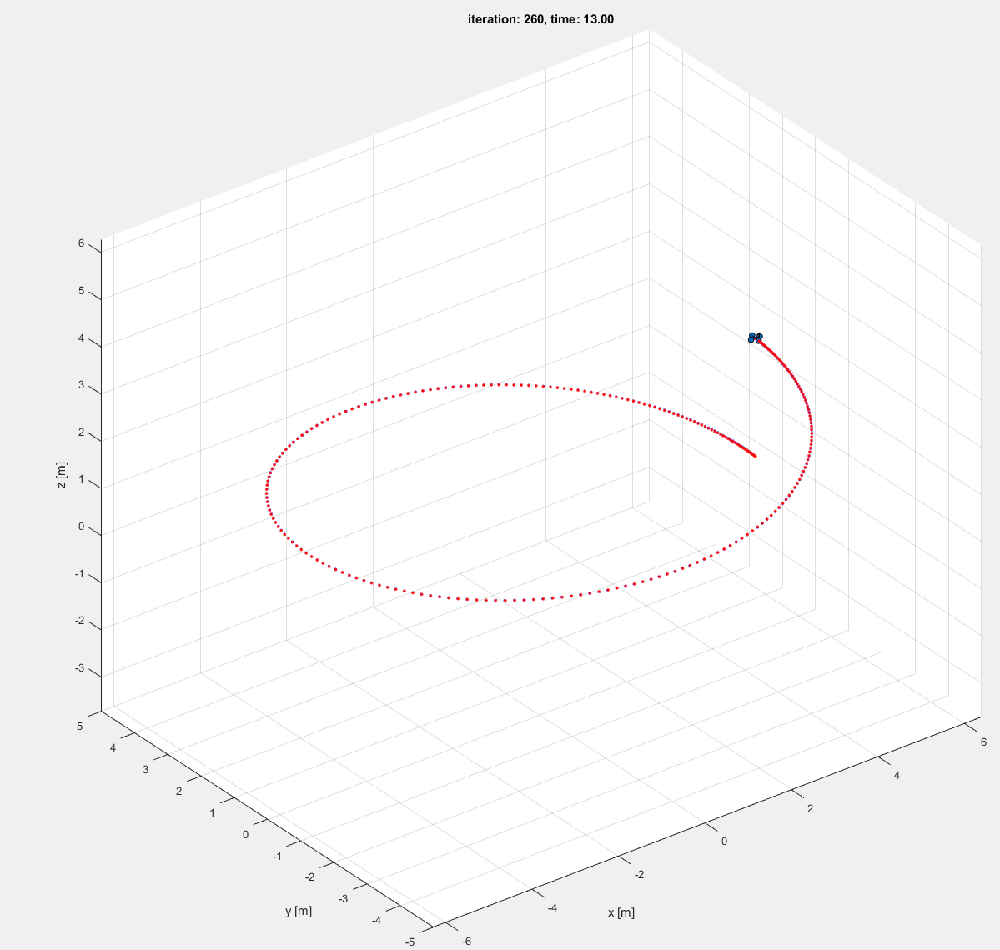
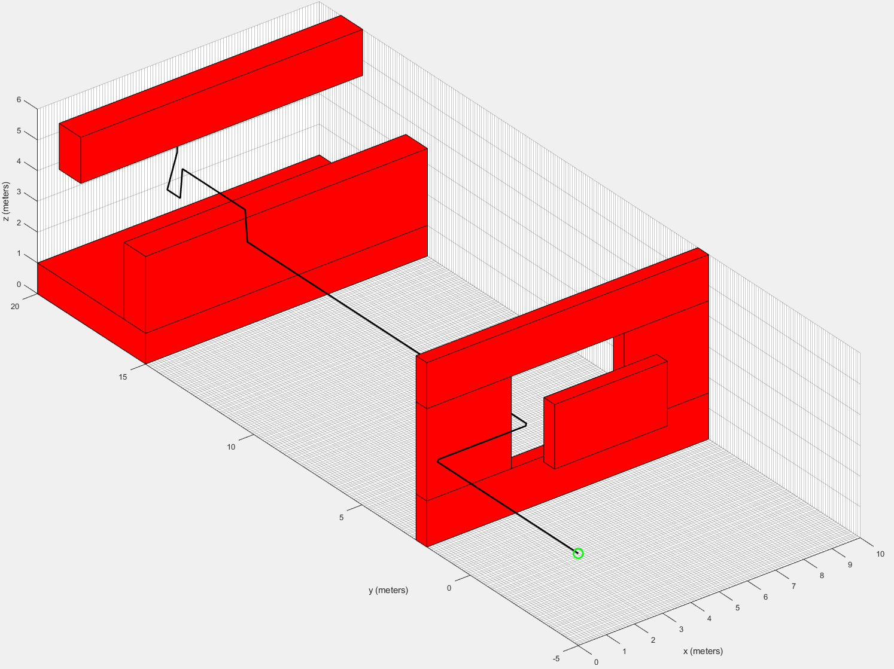
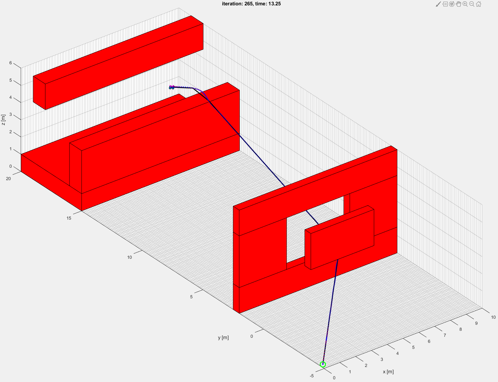

# advanced-robotics

## Project 1 

### Phase 1

controller.m : Implemented geometric nonlinear controller

diamond.m : trajectory is the concatentation of independent quadratic desired velcities from point to point so it reaches a stop before going to the next point. The position is found from integrating the desired velocity using intial conditions to find necessary constants and the acceleration is found from taking its derivative.

circle.m : trajectory is a time parameterized angle which is velocity is set up to speed up and slow back down half way through the helix. With the time parameterized angle, the integral and derivative can be taken to obtain angular position and acceleration. This angle then forms the basis for the quadrotors position along the helix.

### Phase 2

dijkstra.m : runs both Dijkstra and Astar where the Astar heuristic is Euclidean distance to the goal position. The algorithm utilizes a set of vertices on the "frontier" to be explored and set of already "explored vertices which are indicated by logical arrays of where a vertex belongs or no. Each vertex of the space is assigned an index and the index is what is tracked throughout the algorithm to prevent point comparisons. The parent of each node is tracked as the cheapest way to get to that node and the path to the goal is retrieved by tracing back the parents to the starting node. The get the neighbors of a node, a pattern in the assignment of vertices is used to index one unit all around.

helper funcntions in dijkstra.m

getIndex: returns index of an element in a matrix

/utils helper functions:

getNeighbors.m : finds the indices for all vertices that neighbors one of interest
elementwise : helps in convoling all possibilities of directions of travel

### Phase 3

dijkstra.m : Runs both Dijkstra and Astar where the Astar heuristic is Euclidean distance to the goal position. The algorithm utilizes a set of vertices on the "frontier" to be explored and set of already "explored vertices which are indicated by logical arrays of where a vertex belongs or no. Each vertex of the space is assigned an index and the index is what is tracked throughout the algorithm to prevent point comparisons. The parent of each node is tracked as the cheapest way to get to that node and the path to the goal is retrieved by tracing back the parents to the starting node. The get the neighbors of a node, a pattern in the assignment of vertices is used to index one unit all around. This function also returns a pruned map through ray tracing from the function pruneMap()

helper funcntions in dijkstra.m

prunMap: performs forward ray tracing from the start and backward ray tracing to shorten path and make diagonals
getIndex: returns index of an element in a matrix
getNeighbors.m : finds the indices for all vertices that neighbors one of interest
elementwise : helps in convoling all possibilities of directions of travel

trajectory_generator.m : Builds splines between waypoints offline with average acceleration as final time control. The coefficients of the splines are stored and called online depending on what time interval the quadrotor is on. The coefficients of the splines are found by constructing an equation in the form of Ax = b where x contains the coefficients and A contains dt_i^j and b contains waypoints or desired derivatives.

helper funcntions in trajectory_generator.m

minisnap: assembles A and b for each polynomial to solve x = A\b by calling Ab_iPosition and Ab_iDerivative
Ab_iPosition: returns position constraints at the beginning and end of a polynomial time interval
Ab_iDerivative: returns derivative constraints at the beginning and end of a polynomial time interval
	reference: MEAM 517 - Control and Optimization w/ Application to Robotics
		adapted previous code to incorporate 3 dimensional trajectory generation and flexible inputs of polynomial order to be solved

/map
mymap.txt : custom made maze like map to force certain manuevers and test out path pruning methods
mymap.png : shows the planned pruned path and the quadrotors trajectory through it

## Project 2

### Phase 1

