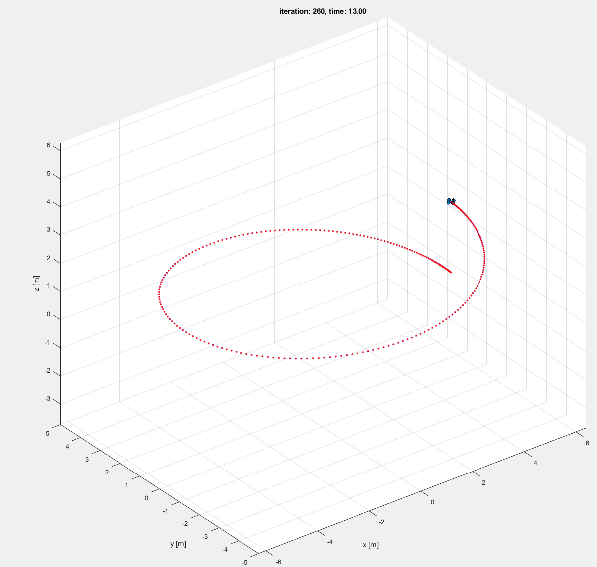
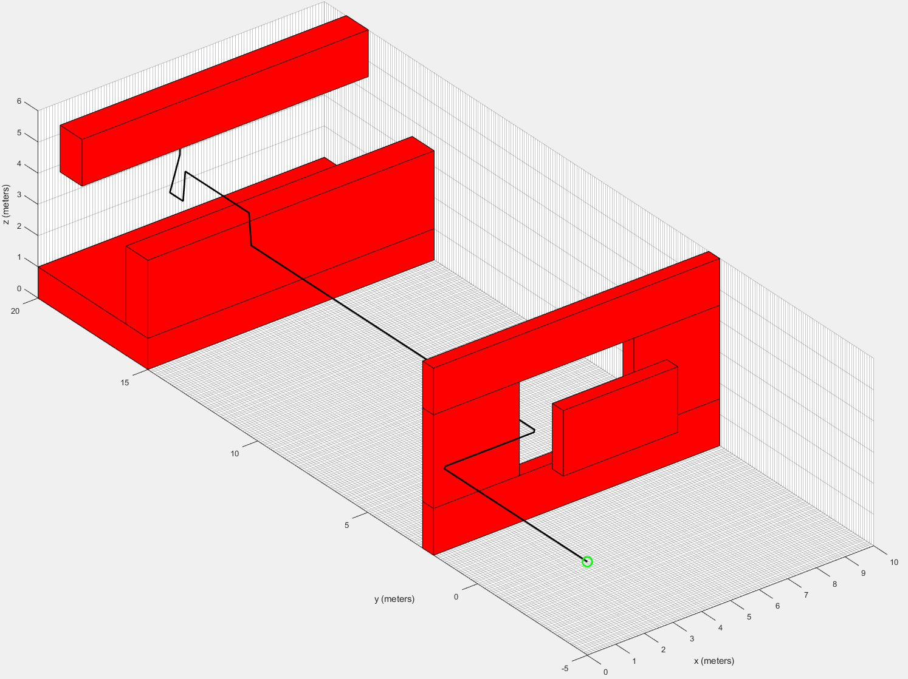
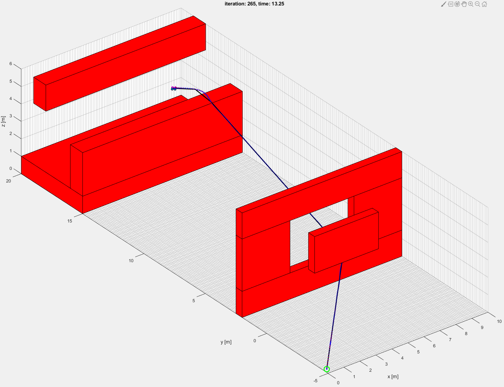
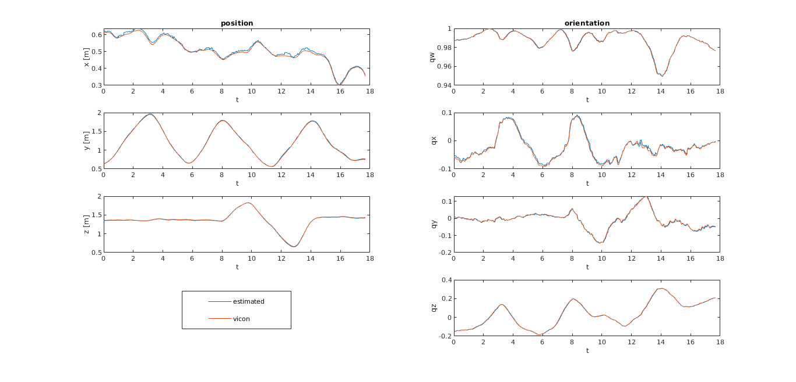
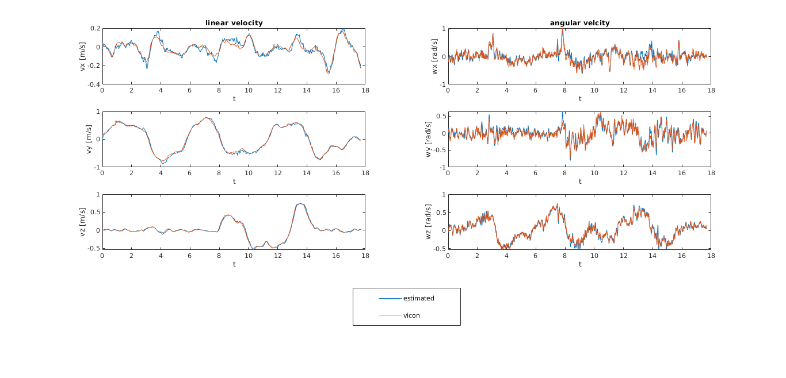
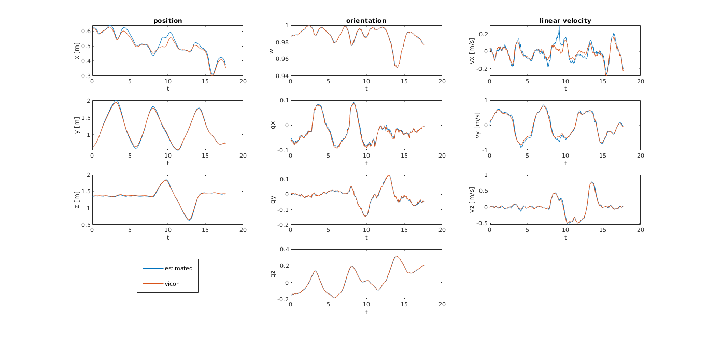

# advanced-robotics

## Project 1 

### Phase 1

Nonlinear geometric controller with generated trajectories of a diamond and helix utlizing quadratic velocity profiles.

More can be found in the project1-1 [submission](project1-1/submission) folder.

### Phase 2

Builds upon project1-1 by running either Dijkstra or Astar with Euclidean distance heuristic to plan a path to goal position.

More can be found in the project1-2 [submission](project1-2/submission) folder

### Phase 3

Runs project1-2 with additional pruning of waypoints through ray tracing to make trajectory generation more efficient and fix discretization. Also creates polynomial trajectories by solving a linear system between waypoints to smoothly travel to the goal.

More can be found in the project1-3 [submission](project1-3/submission) folder

## Project 2

### Phase 1

Uses April Tag information, camera intrinsics, and transformations from imu to estimate pose between two images with homographies.

More can be found in the project2-1 [submission](project2-1/submission) folder

### Phase 2

Builds on project2-1 by utlizing optical flow between two images and RANSAC to estimate velocities.

More can be found in the project2-2 [submission](project2-2/submission) folder

### Phase 3

Incorporates the dynamics of the quadrotor in with the velocity and pose estimates from project2-2 to use an extended kalman filter (ekf).

More can be found in the project2-3 [submission](project2-3/submission) folder

